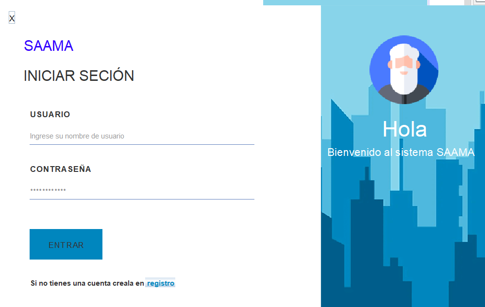
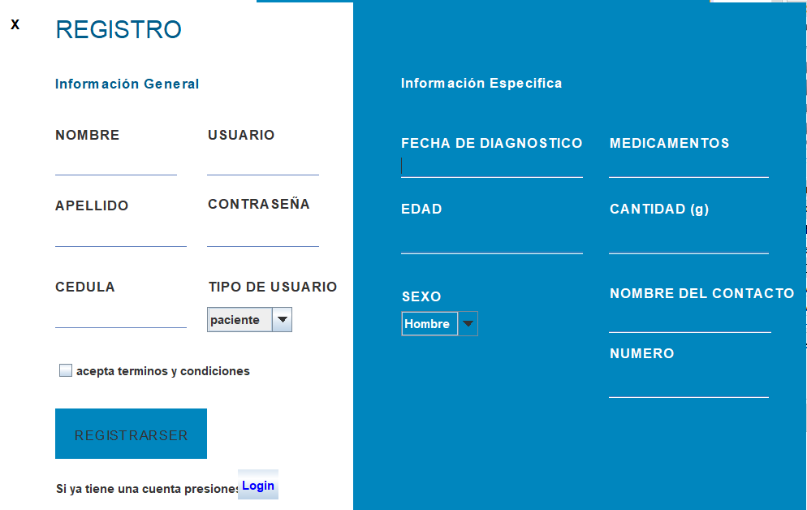
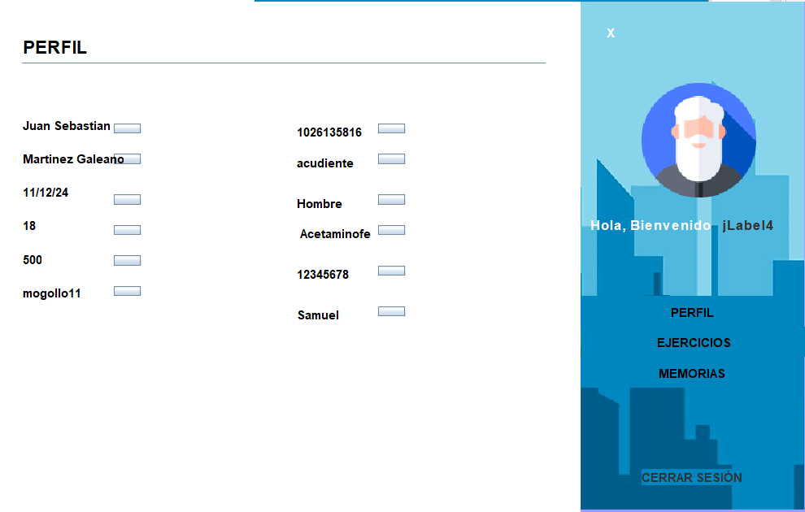
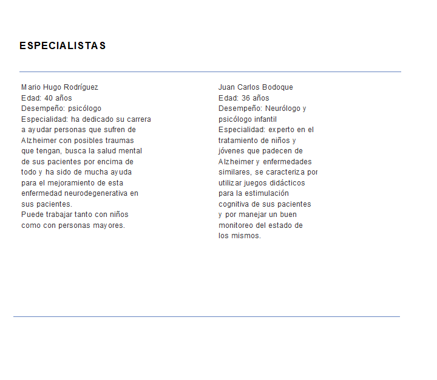
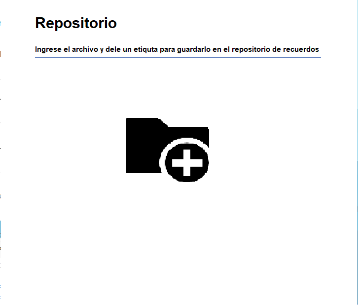

# **ABP Sistema de apoyo para el adulto mayor con alzaimer(SAAMA)**


<figure style="text-align: center;">
  
  <figcaption><strong>Menú Usuario</strong></figcaption>
</figure>

## **Índice**
1. [**Descripción**](#descripción)
2. [**Instalación**](#instalación)
3. [**Herramientas Utilizadas**](#herramientas-utilizadas)
4. [**Uso**](#uso)
    - [**Proceso de Inicio de Sesión**](#proceso-de-inicio-de-sesión)
    - [**Menú Registro**](#menú-registro)
    - [**Interfaz de Usuario**](#interfaz-de-usuario)
        - [**Panel Principal**](#panel-principal)
        - [**Panel de Ejercicios**](#panel-de-ejercicios)
        - [**Panel de Repositorio**](#panel-de-repositorio)
5. [**Estructura del Código**](#estructura-del-código)
    - [**ApLogin**](#aplogin)
    - [**Usuario**](#usuario)
        - [**Atributos**](#atributos)
        - [**Métodos**](#métodos)
            - [**Getters y Setters**](#getters-y-settersingresar-y-devolver)
            - [**Métodos de Clase**](#métodos-de-clase)
    - [**UsuarioLogin**](#usuariologin)
        - [**Atributos**](#atributos-usuario)
        - [**Métodos**](#métodos-usuario)
    - [**MenuLogin**](#-menulogin)
    - [**MenuRegistro**](#menuregistro)
    - [**InterfazUsuario**](#interfazusuario)
        - [**Panel de Principal**](#panel-principal)
        - [**Panel de Ejercicios**](#panel-de-ejercicios)
        - [**Panel de Repositorio**](#panel-de-repositorio)
6. [**Requisitos**](#requisitos)
7. [**Estado**](#estado)
8. [**Licencia**](#licencia)
9. [**Autor**](#autor)


## **Descripción**

Desarrollar un proyecto que sirva como apoyo integral para las personas que padecen Alzheimer. Este proyecto se llevará a cabo mediante una aplicación y/o sitio web que proporcionará herramientas esenciales para facilitar el cuidado y manejo de la enfermedad desde la comodidad del hogar. El objetivo es ayudar tanto al paciente como a sus cuidadores en el tratamiento y manejo de la condición.

## **Instalación**

1. Asegúrate de tener **Python 3.12** o superior instalado en tu sistema.
2. Instala **Git** si aún no lo tienes.
3. Clona el repositorio desde GitHub con el siguiente comando:
   ```bash
   git clone https://github.com/Mogollo7/ABP---Sistema-de-Apoyo-para-el-Adulto-Mayor-con-Alzheimer.git
    ```

## **Herramientas Utilizadas**
- **Python**: Lenguaje base para las funciones del programa.
- **PyQt6**: Utilizado para el diseño de la interfaz gráfica.
- **subprocess**: Módulo para ejecutar comandos del sistema y gestionar procesos.
- **math**: Módulo que proporciona funciones matemáticas para realizar operaciones lógicas en el sistema.
- **Pillow (PIL)**: Biblioteca para el manejo y procesamiento de imágenes.

## **Uso**

### **Proceso de Inicio de Sesión**
Para utilizar el programa, primero debe iniciar **ApLogin.py**, que permite que las ventanas sean visibles. Después de esto, se abrirá **MenuLogin.py**, donde encontrará el inicio de sesión que le dará la bienvenida al sistema **SAMMA**. 
1. **Ingreso de Datos**: Debe ingresar su nombre de usuario y contraseña, y presionar el botón "Entrar" para acceder al sistema.
2. **Registro**: Si no se ha registrado, debajo del botón "Entrar" encontrará un redireccionador que lo llevará a la ventana de **Menú Registro**.

### **Menú Registro**
En esta sección, se solicitarán los siguientes datos:
- Nombre
- Apellido
- Cédula
- Contraseña
- Tipo de usuario
- Fecha de diagnóstico
- Edad
- Sexo
- Medicamentos (nombre y cantidad)
- Nombre del contacto
- Número de contacto de emergencia

Además, habrá un botón para aceptar los términos y condiciones. Después de completar todos los datos, podrá registrarse y será redirigido a **MenuLogin.py** para ingresar nuevamente sus datos de usuario y contraseña.

### **Interfaz de Usuario**
Una vez que inicie sesión, accederá a la ventana **Interfaz de Usuario**, donde verá un perfil principal con toda la información ingresada previamente. En la parte derecha inferior, encontrará los siguientes botones:
- **Perfil**: Muestra toda la información ingresada.
- **Ejercicio**: Contiene especialistas que se pueden contactar para realizar ejercicios, así como algunos ejercicios básicos de memoria y motricidad que se pueden realizar en casa.
- **Memorias**: En esta sección, podrá gestionar:
  - Recordatorios de pastillas: Puede modificar o agregar más medicamentos para que se le recuerde el día.
  - Recuerdos: Agregar fotos y descripciones para recordar momentos importantes.


## **Estructura del Código**
### **ApLogin**
ApLogin es el apartado que nos permite iniciar el programa, ya que es la clase principal y hace que las ventanas sean visibles.
```Python
MenuLogin.show()  # Mostrar la ventana
    sys.exit(app.exec())  # Ejecutar la aplicación
## **MenuLogin.py**
## **InterfazUsuario**
```

### **Usuario**
La clase `Usuario` proporciona una estructura básica para manejar información relacionada con los usuarios, incluyendo la verificación de usuarios existentes y el inicio de sesión. Utiliza una lista para almacenar y recuperar los usuarios, interactuando con la clase `UsuarioLogin` para obtener la lista de usuarios. 

La clase `Usuario` forma parte del módulo `Capa` y se utiliza para gestionar los datos de los usuarios en el sistema. A continuación, se detallan sus atributos y métodos.

#### Atributos
- `nick`: Almacena el apodo o nombre de usuario del usuario.
- `contraseña`: Almacena la contraseña del usuario.


#### Métodos

##### Getters y Setters(ingresar y devolver)
- `get_nick()`: Devuelve el nombre de usuario.
- `set_nick(nick)`: Establece el nombre de usuario.
- `get_contraseña()`: Devuelve la contraseña.
- `set_contraseña(contraseña)`: Establece la contraseña.


##### Métodos de Clase
- `verificar_usuario_nuevo(usuario)`: 
  - **Descripción**: Verifica si un nuevo usuario ya existe en la lista de usuarios.
  - **Parámetros**: 
    - `usuario`: El nombre de usuario a verificar.
  - **Retorno**: Devuelve el índice del usuario en la lista si existe; de lo contrario, devuelve `-1`.

- `verificar_login(usuario, contraseña)`:
  - **Descripción**: Verifica las credenciales de inicio de sesión del usuario.
  - **Parámetros**: 
    - `usuario`: El nombre de usuario a verificar.
    - `contraseña`: La contraseña a verificar.
  - **Retorno**: Devuelve el índice del usuario en la lista si las credenciales son correctas; de lo contrario, devuelve `-1`.

- `mostrar()`: 
  - **Descripción**: Obtiene la lista de usuarios a través de la clase `UsuarioLogin`.
  - **Retorno**: Devuelve una lista que contiene los usuarios.


### **UsuarioLogin**

La clase `UsuarioLogin` es parte del módulo `Capa` y se utiliza para gestionar una colección de objetos de tipo `Usuario`. Proporciona métodos para agregar, eliminar y mostrar usuarios almacenados en una estructura de datos tipo `list`.

#### Atributos Usuario

- **`datos`**: Este atributo es de tipo `list` y actúa como una colección que almacena instancias de la clase `Usuario`. Dado que es una lista, puede crecer dinámicamente y permite almacenar múltiples instancias de `Usuario`.

#### Métodos Usuario

1. **`agregar(obj)`**: Este método recibe un objeto `Usuario` y lo añade a la colección `datos`. Se utiliza para registrar nuevos usuarios en el sistema.

2. **`eliminar(pos)`**: Este método elimina un usuario de la colección en la posición especificada. Toma un entero que indica la posición del usuario que se desea eliminar en la lista. Se utiliza para eliminar usuarios del sistema, por ejemplo, cuando un usuario decide borrar su cuenta.

3. **`mostrar()`**: Este método devuelve la colección de usuarios almacenados en `datos`. Retorna una lista que contiene todos los objetos `Usuario` y se utiliza para mostrar la lista de usuarios registrados, permitiendo el acceso a los datos de todos los usuarios en el sistema.

### ** MenuLogin** 

En este apartado se comienzan a utilizar las funciones anteriores de los códigos. Se presenta una interfaz gráfica en donde se deben ingresar el usuario y la contraseña. A través de una estructura de control `if`, se comprueba si las credenciales ingresadas son iguales a las registradas. Si no se ha registrado, hay un botón que redirecciona automáticamente a la ventana del menú registro.

<figure style="text-align: center;">
  
  <figcaption><strong></strong></figcaption>
</figure>


### **MenuRegistro**
En este menú, se ingresa toda la información que será guardada. Esta información luego será pasada a la interfaz de usuario.
<figure style="text-align: center;">
  
  <figcaption><strong></strong></figcaption>
</figure>

### **InterfazUsuario**

La interfaz de usuario está dividida en dos partes: un panel principal y un panel lateral con una serie de botones llamados "Perfil", "Ejercicios" y "Memorias".


##### **Panel Principal**

En el botón de "Perfil", aparecerán todos los datos ingresados en los labels de menú de registro. En el lado derecho, se encuentra un botón que permite editar esta información.

<figure style="text-align: center;">
  
  <figcaption><strong></strong></figcaption>
</figure>

##### **Panel de Ejercicios**

En el apartado de "Ejercicios", se encuentran los nombres de información de especialistas en los cuales los usuarios pueden apoyarse. Más adelante, se organizarán ejercicios didácticos.

<figure style="text-align: center;">
  
  <figcaption><strong></strong></figcaption>
</figure>

##### **Panel de Repositorio**

En el apartado de "Memorias", se encuentra el espacio para ingresar memorias, ya sean fotos y descripciones de estas, para poder recordar momentos especiales.


<figure style="text-align: center;">
  
  <figcaption><strong></strong></figcaption>
</figure>

## **Requisitos**

- **Python 3.11+**
- **Tkinter** (generalmente viene preinstalado con Python en la mayoría de las distribuciones)

## **Estado**
En proceso
## **Licencia**

Este proyecto está licenciado bajo la [MIT License](https://github.com/Mogollo7/ABP---Sistema-de-Apoyo-para-el-Adulto-Mayor-con-Alzheimer/blob/main/LICENSE).

## **Autor**

- [Juan Sebastián Martínez Galeano](https://github.com/Mogollo7?tab=repositories)
- [Samuel Usma Brand](https://github.com/Brandsete)
